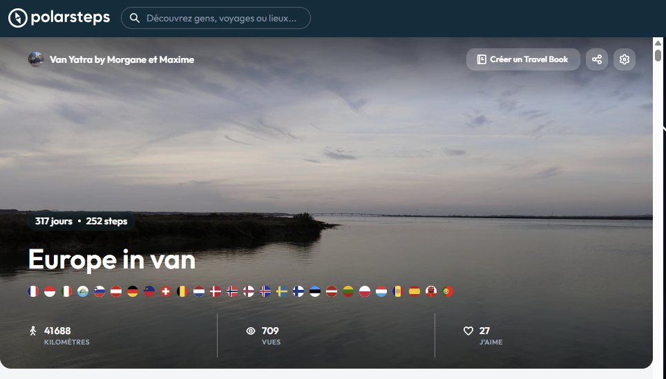
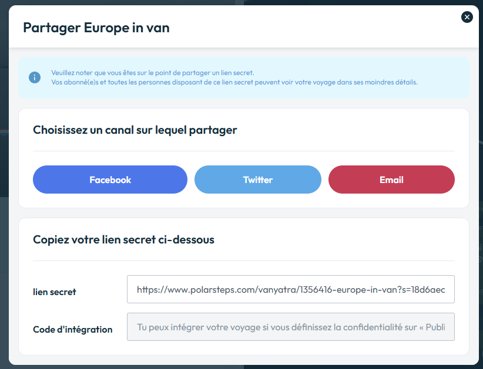

# polarstepsToGpx

Convert a polarsteps trip into a gpx file using polarsteps API

# How it works

This script is using the polarsteps API to retrieve all the localisation data.
The user just has to provide the sharing trip url from the polarsteps app.

If the trip is public, the url just contains the trip id and the trip name,
otherwise the url contains a secret query param (s=) that we will use to retrieve data from API.

We use the API version 62, just like the polarsteps website to be able to retrieve all the tracker data.

# Use it in your browser (recommended)

- Open [https://rimaxime.github.io/polarstepsToGpx/web](https://rimaxime.github.io/polarstepsToGpx/web/index.html)
- Enter your polarsteps sharing URL
- Download the GPX file

## Backend 
To avoid CORS issues, we added a small request proxy deployed in cloudfare worker. 
This is just a request forwarder, the source code is available in the corsProxy folder and all observability options are disabled on cloudfare worker.

# Use it with python (advanced)

- Install the requirements from the requirements.txt file (`$ pip install -r requirements.txt`)
- execute the main.py script with below parameters (`$ python main.py --input https://www.polarsteps.com/Username/12345678-trip?s=secret`)

# Usage

Usage: main.py [OPTIONS]

Options:

| Parameter           | Type                | Description                                                                                                                                               |
| ------------------- | ------------------- | --------------------------------------------------------------------------------------------------------------------------------------------------------- |
| --input             | TEXT                | Input Url of your polarsteps trip [required]                                                                                                              |
| --output            | TEXT                | Gpx Filename. By default 'report.gpx'                                                                                                                     |
| --data-source       | TEXT                | Option is 'steps' or 'localisation' or 'combined' to build gpx with steps data or full polarsteps tracking data. By default, the option is 'combined'     |
| --from-date         | DATETIME [%Y-%m-%d] | Optionally Define the start date to be able to filter only a specific part of the trip. Format is YYYY-MM-DD.                                             |
| --to-date           | DATETIME [%Y-%m-%d] | Optionally Define the end date to be able to filter only a specific part of the trip. Format is YYYY-MM-DD.                                               |
| --include-step-data | BOOLEAN             | Include step name and description as gpx waypoint. If false, waypoints will be defined with polarsteps tracker locality. By default, the option is 'True' |
| --help              |                     | Show this message and exit.                                                                                                                               |

# How to retrieve the sharing trip url

- Go to your polarsteps profile on website or mobile app
- Navigate to your trip
  
- Click on the sharing button
  
- Copy the secret link url

# Authors
- [@rimaxime](https://github.com/rimaxime)
- [@agroqirax](https://github.com/agroqirax)